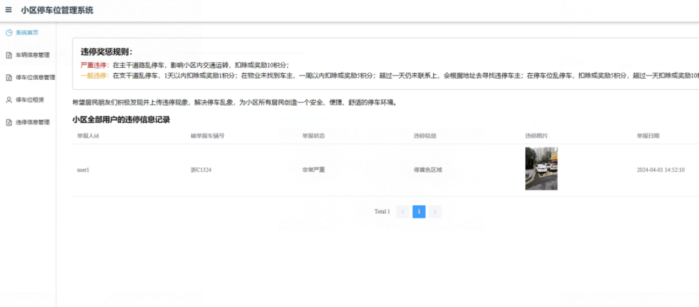
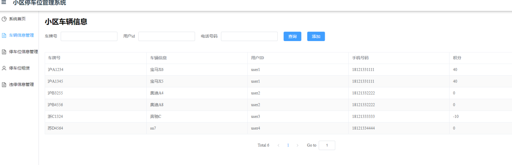
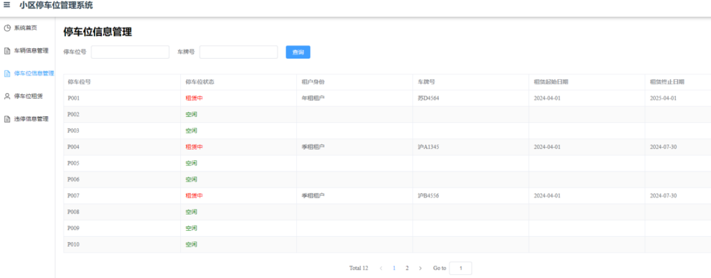
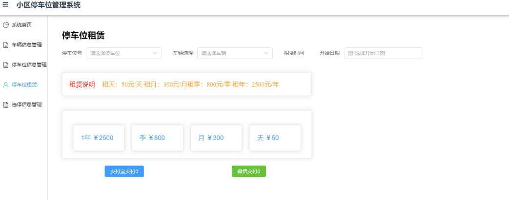
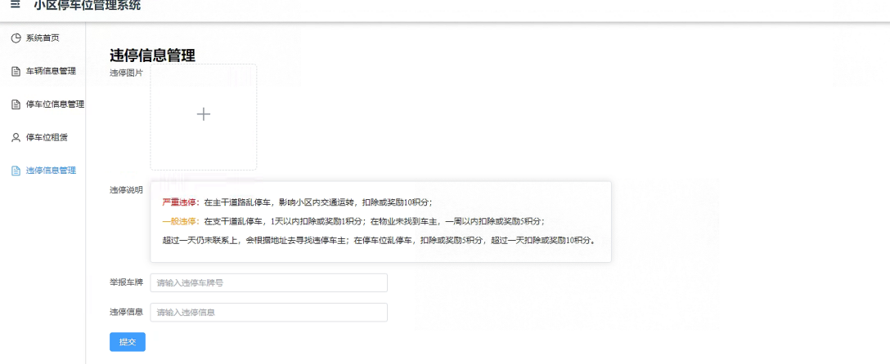

# ParkingManagement

## 小区停车位管理系统

架构：Django、Vue、mysql

### 功能描述：
* 用户登录注册
* 用户个人信息修改
* 用户车辆新增修改删除
* 用户停车位状态查询以及对空车位租赁（按月季年租赁，有不同积分）
* 用户对违停车辆进行举报（按审批的严重程度，有不同积分奖惩）
* 管理员对停车位新增、删除
* 管理员对车辆信息修改
* 管理员对举报记录进行审核

### 图片展示：

* 源代码+万字论文/报告：100 RMB
* 源代码+万字论文/报告+远程控制配置环境并运行：150 RMB

### 闲鱼：比奇堡的章鱼哥（优先）
### 微信：Neverland_996
### QQ：2914623954

其他C++\Python需求也可咨询，含数据结构，操作系统等在线考试\远程帮助，爬虫，数据可视化，文本分类等

